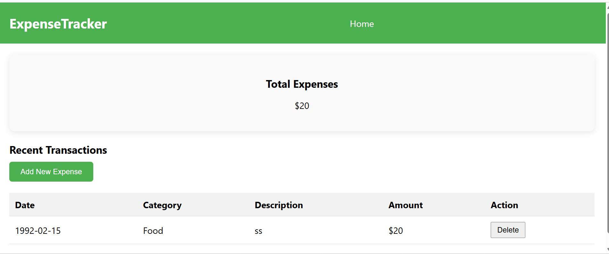
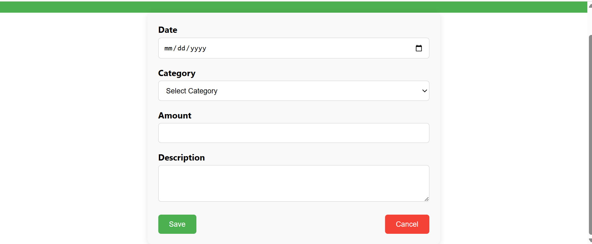

# 💰 Expense Tracker ReactJS

A simple expense tracker built with **React.js**, css.

---

## 🖼️ Screenshots

### 🏠 Homepage


### ➕ Add Expense



---

## 🚀 How to Run Locally

```bash
git clone https://github.com/ysukkar2/expense-tracker-reactjs.git
cd expense-tracker-reactjs
npm install
npm start
